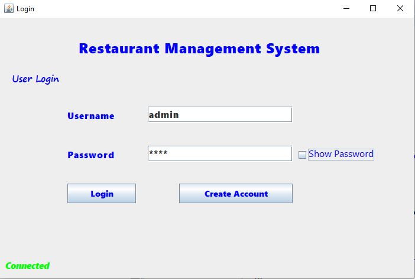
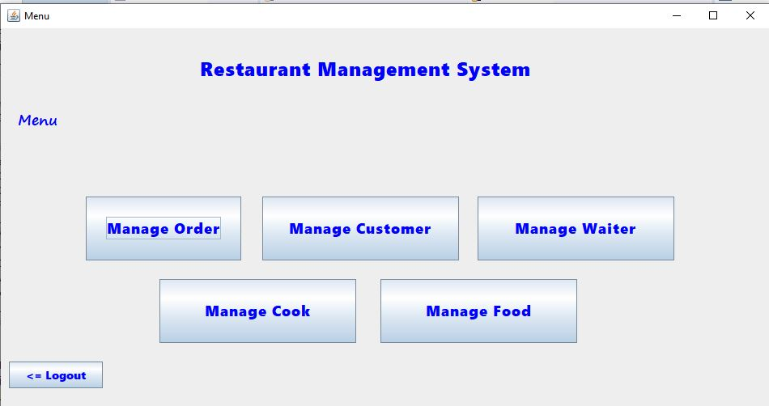
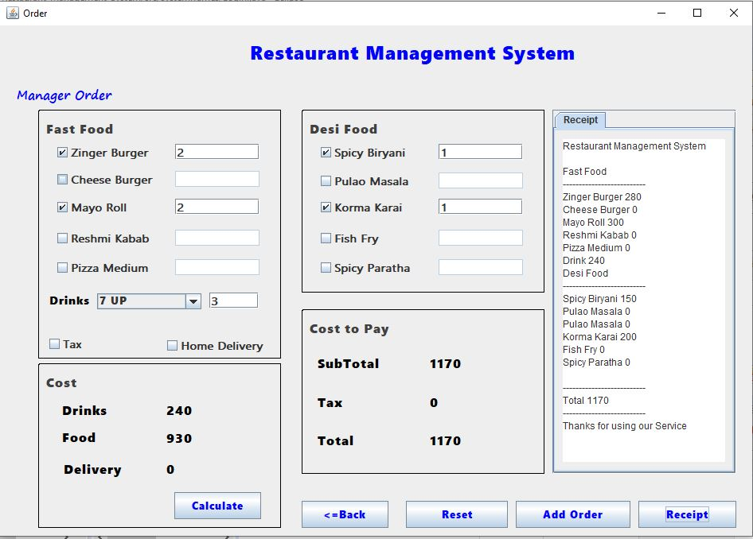
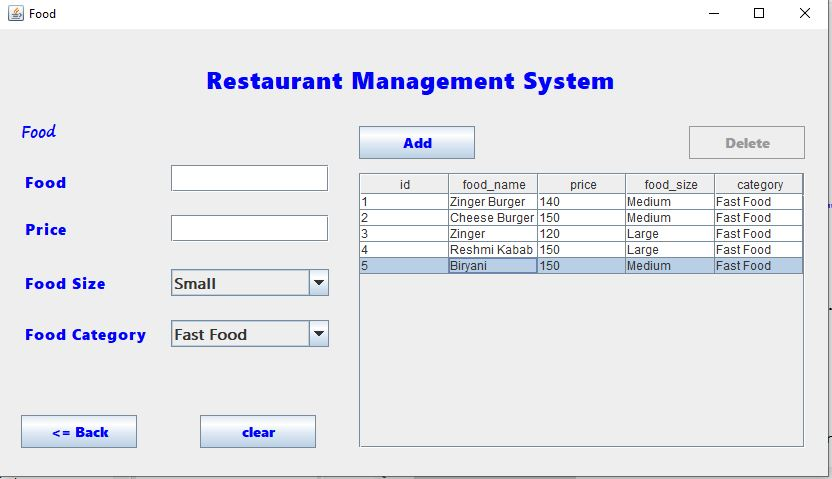
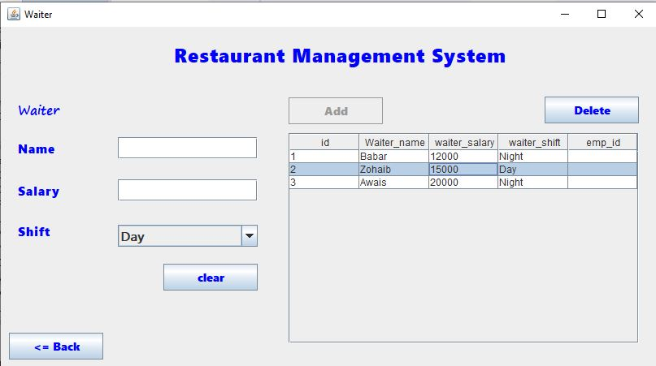
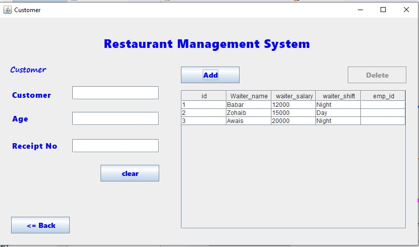

# Restaurant_Management_System

### A Restaurant Management System is a Desktop Application integrated with MySQL database which is used to manage all the activities or staff in a Restaurant.

### Login Screen

### Menu Screen

### Order Screen

### Food Screen

### Waiter Screen

### Customer Screen

